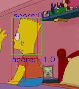
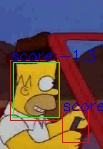
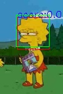
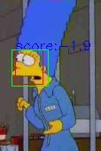
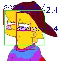
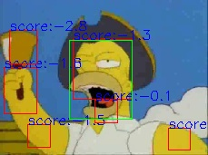

# The Simpsons face detection and characters recognition

This project uses:
<ul>
  <li>HOG features</li>
  <li>2 neural networks as classifiers, one for detection and one for recognition</li>
  <li>sliding window for detection</li>
</ul>

The data was collected from a dataset containing 4400 images taken from The Simpsons series. The positives examples were the faces of the characters, and the negative examples were extracted randomly at different scales from the images in the dataset.The dataset was augmented with positive examples. Each image of a face was flipped, translated and rotated using methods from openCV. Hence, for every positive example I generated another 53 examples.

Below you can see how the detector performs on the test data. Some of them look good, some not so much. =)))

  
  
  
  
  
  

